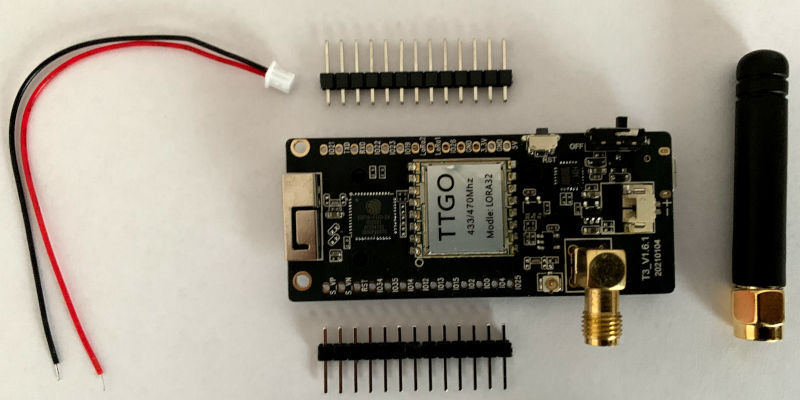
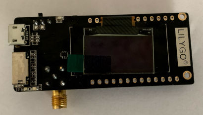

# 22.5.2021 Tilaus saapui
`Harry Karvonen, Pispalan IT`

Viikko sitten tilaamani radiot saapuivat UPS:n toimittamana.

Tilaus sisälsi kaiken mitä oletinkin. Tosin pari rimaa oli irtonaisena ja ne
pitää itse juottaa kiinni, mikäli niitä tarvitsee. Tilauksen sisältö esitetty
seuraavassa kuvassa.



Laitteen toisella puolella on OLED-näyttö, kuten seuraavasta kuvasta käy ilmi.




Pian pääsen tutkimaan, miten [LoRa-radion](https://en.wikipedia.org/wiki/LoRa)
kanssa kommunikointi tapahtuu. Ehkä jo ensi viikonloppuna saan ensimmäisen
radio-paketin lähetyksen ja vastaanoton tehtyä.

Nopealla kokeilulla varmistin että laite käynnistyy ja antaa jotain elon
merkkejä. Kytkin laitteen USB-piuhalla koneeseen ja totesin että laiten käyy
USB-sarjaportti-sovittimena. Elonmerkkien varmistuminen tapahtui käyttämällä
`minicom`-ohjelmaa. Laitteen asetukset ovat 115 200 bit/s ja 8N1.

Komennon käynnistämisen yhteydessä valitsen laitteeksi /dev/ttyACM0.

```
$ minicom -D /dev/ttyACM0
```

Pätkä ulostuloa:
```
[I][reset.cpp:64] do_after_reset(): Starting Software v1.9.982, runmode 0
[I][configmanager.cpp:190] loadConfig(): Reading settings from NVS
[I][configmanager.cpp:55] open_storage(): Opening NVS
[I][configmanager.cpp:60] open_storage(): Done
[I][configmanager.cpp:204] loadConfig(): NVRAM settings version = 1.9.982
[I][configmanager.cpp:222] loadConfig(): bsecstate = 0
[I][configmanager.cpp:227] loadConfig(): loradr = 5
[I][configmanager.cpp:235] loadConfig(): txpower = 14
[I][configmanager.cpp:243] loadConfig(): adrmode = 1
[I][configmanager.cpp:251] loadConfig(): screensaver = 0
[I][configmanager.cpp:259] loadConfig(): screenon = 1
[I][configmanager.cpp:267] loadConfig(): countermode = 0
[I][configmanager.cpp:275] loadConfig(): sendcycle = 30
[I][configmanager.cpp:283] loadConfig(): wifichancycle = 50
[I][configmanager.cpp:291] loadConfig(): wifiantenna = 0
[I][configmanager.cpp:299] loadConfig(): vendorfilter = 1
[I][configmanager.cpp:307] loadConfig(): rgbluminosity = 30
[I][configmanager.cpp:315] loadConfig(): blescantime = 8
[I][configmanager.cpp:323] loadConfig(): BLEscanmode = 0
[I][configmanager.cpp:331] loadConfig(): WIFIscanmode = 1
[I][configmanager.cpp:339] loadConfig(): rssilimit = 0
[I][configmanager.cpp:347] loadConfig(): payloadmask = 127
[I][configmanager.cpp:355] loadConfig(): Monitor mode = 0
[I][configmanager.cpp:362] loadConfig(): Done
[I][i2c.cpp:23] i2c_scan(): Starting I2C bus scan...
[I][i2c.cpp:44] i2c_scan(): 0x3C: SSD1306 Display controller
[I][i2c.cpp:71] i2c_scan(): I2C scan done, 1 devices found.
[I][main.cpp:242] setup(): Starting LED Controller...
[I][power.cpp:171] calibrate_voltage(): ADC characterization based on reference voltage stored in eFuse
[I][lorawan.cpp:297] lora_stack_init(): LORA send queue created, size 600 Bytes
[I][lorawan.cpp:300] lora_stack_init(): Starting LMIC...
[I][main.cpp:375] setup(): Starting Wifi...
[I][main.cpp:388] setup(): Starting Interrupt Handler...
[I][main.cpp:412] setup(): Starting Timers...
[I][main.cpp:470] setup(): Starting Timekeeper...
[I][timekeeper.cpp:151] timepulse_init(): Timepulse: internal (ESP32 hardware timer)
[I][timesync.cpp:52] timesync_request(): [10.508] Timeserver sync request seqNo#114 started
[I][main.cpp:477] setup(): Features: OLED LED BATT OTA LORA FILTER PACKED WIFI
[I][cyclic.cpp:73] doHousekeeping(): Battery: 4114mV
```

Tästä pystyn toteamaan että laite ainakin on hengissä. Radion toimintaa ei
vielä tämän perusteella pysty varmistaan. Laitteen OLED-näytössä näkyi myös
jotain dataa, josta ei vielä ole hajua mitä kaikkea ne tarkoittavat.
