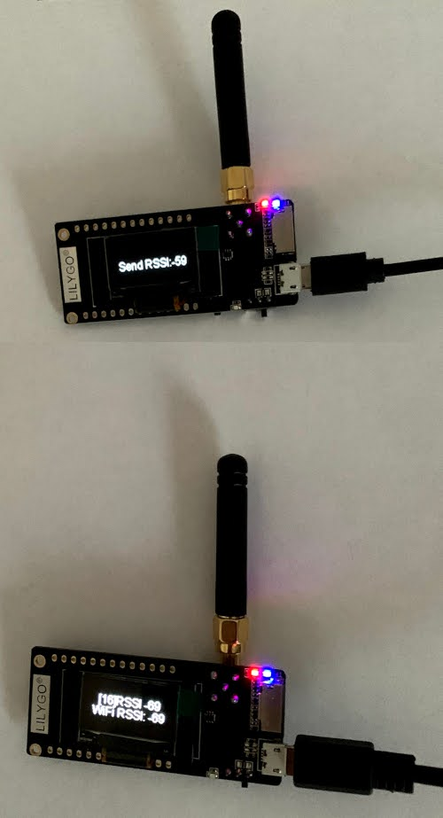

# 6.6.2021 ESP32 Arduino
`Harry Karvonen, Pispalan IT`

Tänään tutkin miten ohjelmointia tehdään ESP32-mikro-ohjaimelle. Kyseltyäni
tutuilta joilla oli jotain kosketusta näihin mikro-ohjaimiin, sain selville
että ohjelmointi onnistuu suoraan [Arduino IDE:llä](https://www.arduino.cc).

Aloitin asentamalla Arduino IDE:n [Fedora 34:lle](https://fedoraproject.org)
seuraavalla komennolla:

```bash
# Roottina
$ su
$ dnf -y install arduino
```

ESP32:sta varten tarvitaan myös arduino-esp32 paketti. Asennuksen tein
seuraamalla [seuraavia
ohjeita](https://oneguyoneblog.com/2018/08/06/esp32-arduino-ide-linux-windows/).
Ohjeissa oli asennukset tehty graafisen käyttöliittymän kautta. Kirjoitan
myöhemmin, miten nämä asetukset pystytään tekemään käyttämällä
[arduino-cli](https://www.arduino.cc/pro/cli) -komentorivityökalua.

Arduinon käyttöä varten tarvitaan myös Python-paketteja. Tätä varten loin uuden
[Pythonin virtuaaliympäristön](https://docs.python.org/3/tutorial/venv.html).
Lisäksi täytyi asentaa Python-paketti
[pyserial](https://pypi.org/project/pyserial/). Asensin myös samalla samaan
ympäristöön [esptool-paketin](https://github.com/espressif/esptool), jolla
pystyy suoraan kommunikoimaan ESP32-mikro-ohjaimen kanssa. Esimerkiksi
kirjoittamaan flash-muistiin. Arduino on käynnistettävä konsolista siten että
tämä luotu Python-ympäristö on aktiivisena. Tässä listattu komennot
asentamista varten.

```bash
# Luodaan virtuaaliympäristö
$ python -m venv ~/.virualenvs/esptool

# Aktivoidaan ympäristö
$ . ~/.virtualenvs/esptool/bin/active

# asennetaan pyserial ja esptool
$ pip install pyserial esptool
```

Mahdollisesti ensimäistä kertaa käynnistäessäsi Arduino IDE:ä voit joutua
sallimaan käyttäjän lisäämisen tiettyyn ryhmään. Tämä vaatii järjestelmän
valvojan käyttöoikeudet.

Arduinon käynnistäminen:
```bash
# Aktivoidaan ympäristö
$ . ~/.virtualenvs/esptool/bin/active
$ arduino
```

## TTGO-LoRa-Series

Arduinon IDE:llä tein käännökset seuraavasta projektista
[TTGO-LoRa-Series](https://github.com/Xinyuan-LilyGO/TTGO-LoRa-Series).
Ensimmäiset yrittämiset epäonnistuivat puutuvien otsikko-tiedostojen ja
lähdekoodien takia. Tämän projektin
[README:stä](https://github.com/Xinyuan-LilyGO/TTGO-LoRa-Series/blob/master/README.MD)
löytyi viittaukset riippuvuuksiin
[arduino-LoRa](https://github.com/sandeepmistry/arduino-LoRa) ja
[oled-ssd1306](https://github.com/ThingPulse/esp8266-oled-ssd1306). Näiden
riippuvuuksien löytäminen graafisella työkalulla Arduino IDE:stä osoittautui
hieman mutkikkaammaksi kuin oletin. Nimittäin hakusanalla LoRa löytyi useita
paketteja. Samoin hakusanalla oled löytyi useita paketteja. Riippuvuuksien
URL:sta löytyi onneksi tekijä ja sen perusteella löytyi oikea paketti, jotta
käännös onnistui.

Arduinon käyttöön on myös olemassa komentorivi-työkalu arduino-cli. Tällä
työkalulla on helpompi automatisoida tekemistä ja eksplisiittisesti määrittää
mitä halutaan asentaa.

Toimivan käännöksen tuottamiseksi seuraavat paketit ovat asennettu:
```json
[
  {
    "library": {
      "name": "ESP8266_and_ESP32_OLED_driver_for_SSD1306_displays",
      "author": "ThingPulse, Fabrice Weinberg",
      "maintainer": "ThingPulse \u003cinfo@thingpulse.com\u003e",
      "sentence": "I2C display driver for SSD1306 OLED displays connected to ESP8266, ESP32, Mbed-OS",
      "paragraph": "The following geometries are currently supported: 128x64, 128x32, 64x48. The init sequence was inspired by Adafruit's library for the same display.",
      "website": "https://github.com/ThingPulse/esp8266-oled-ssd1306",
      "category": "Display",
      "architectures": [
        "esp8266",
        "esp32"
      ],
      "install_dir": "/home/kayttaja/Arduino/libraries/ESP8266_and_ESP32_OLED_driver_for_SSD1306_displays",
      "source_dir": "/home/kayttaja/Arduino/libraries/ESP8266_and_ESP32_OLED_driver_for_SSD1306_displays/src",
      "real_name": "ESP8266 and ESP32 OLED driver for SSD1306 displays",
      "version": "4.2.0",
      "license": "Unspecified",
      "location": 1,
      "layout": 1,
      "examples": [
        "/home/kayttaja/Arduino/libraries/ESP8266_and_ESP32_OLED_driver_for_SSD1306_displays/examples/SSD1306ClockDemo",
        "/home/kayttaja/Arduino/libraries/ESP8266_and_ESP32_OLED_driver_for_SSD1306_displays/examples/SSD1306DrawingDemo",
        "/home/kayttaja/Arduino/libraries/ESP8266_and_ESP32_OLED_driver_for_SSD1306_displays/examples/SSD1306OTADemo",
        "/home/kayttaja/Arduino/libraries/ESP8266_and_ESP32_OLED_driver_for_SSD1306_displays/examples/SSD1306SimpleDemo",
        "/home/kayttaja/Arduino/libraries/ESP8266_and_ESP32_OLED_driver_for_SSD1306_displays/examples/SSD1306TwoScreenDemo",
        "/home/kayttaja/Arduino/libraries/ESP8266_and_ESP32_OLED_driver_for_SSD1306_displays/examples/SSD1306UiDemo"
      ],
      "provides_includes": [
        "OLEDDisplay.h",
        "OLEDDisplayFonts.h",
        "OLEDDisplayUi.h",
        "SH1106.h",
        "SH1106Brzo.h",
        "SH1106Spi.h",
        "SH1106Wire.h",
        "SSD1306.h",
        "SSD1306Brzo.h",
        "SSD1306I2C.h",
        "SSD1306Spi.h",
        "SSD1306Wire.h"
      ]
    }
  },
  {
    "library": {
      "name": "LoRa",
      "author": "Sandeep Mistry \u003csandeep.mistry@gmail.com\u003e",
      "maintainer": "Sandeep Mistry \u003csandeep.mistry@gmail.com\u003e",
      "sentence": "An Arduino library for sending and receiving data using LoRa radios.",
      "paragraph": "Supports Semtech SX1276/77/78/79 based boards/shields.",
      "website": "https://github.com/sandeepmistry/arduino-LoRa",
      "category": "Communication",
      "architectures": [
        "*"
      ],
      "install_dir": "/home/kayttaja/Arduino/libraries/LoRa",
      "source_dir": "/home/kayttaja/Arduino/libraries/LoRa/src",
      "real_name": "LoRa",
      "version": "0.8.0",
      "license": "Unspecified",
      "location": 1,
      "layout": 1,
      "examples": [
        "/home/kayttaja/Arduino/libraries/LoRa/examples/LoRaDumpRegisters",
        "/home/kayttaja/Arduino/libraries/LoRa/examples/LoRaDuplex",
        "/home/kayttaja/Arduino/libraries/LoRa/examples/LoRaDuplexCallback",
        "/home/kayttaja/Arduino/libraries/LoRa/examples/LoRaReceiver",
        "/home/kayttaja/Arduino/libraries/LoRa/examples/LoRaReceiverCallback",
        "/home/kayttaja/Arduino/libraries/LoRa/examples/LoRaSender",
        "/home/kayttaja/Arduino/libraries/LoRa/examples/LoRaSenderNonBlocking",
        "/home/kayttaja/Arduino/libraries/LoRa/examples/LoRaSenderNonBlockingCallback",
        "/home/kayttaja/Arduino/libraries/LoRa/examples/LoRaSetSpread",
        "/home/kayttaja/Arduino/libraries/LoRa/examples/LoRaSetSyncWord",
        "/home/kayttaja/Arduino/libraries/LoRa/examples/LoRaSimpleGateway",
        "/home/kayttaja/Arduino/libraries/LoRa/examples/LoRaSimpleNode"
      ],
      "provides_includes": [
        "LoRa.h"
      ]
    }
  }
]
```

Lopulta ladattuani ja käynnistettyä laitteet sain ne lähettämään ja
vastaanottamaan lähetyksiä. Käytin tuota TTGO-LoRa-Series projektia ja tein
toisesta radiosta lähettimen ja toisesta vastaanottajan. Päivitin WLAN:nin
yhteyden SSID:n ja WPA-salaisuuden.



Myös sarjaportin kautta saa nyt järkevää informaatiota. Tosin suurin osa
informaatiosta näytetään oled-näytöllä.
